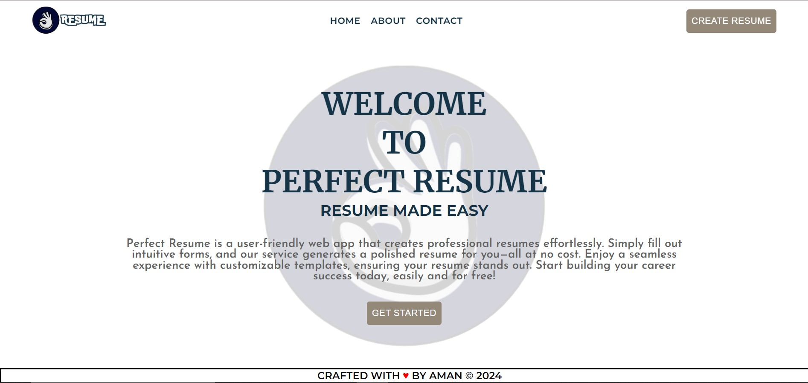
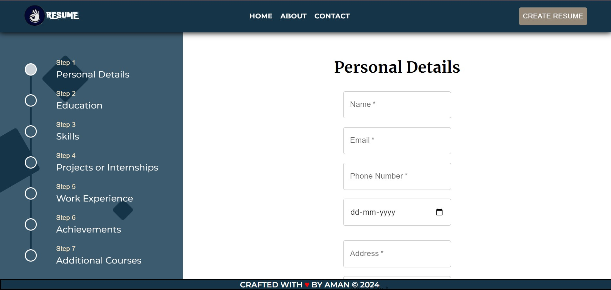

# Perfect Resume :mortar_board:

 Perfect Resume is a user-friendly web app that creates professional
          resumes effortlessly. Simply fill out intuitive forms, and our service
          generates a polished resume for you—all at no cost. Enjoy a seamless
          experience with customizable templates, ensuring your resume stands
          out. Start building your career success today, easily and for free!


    [](https://choosealicense.com/licenses/mit/)

   


## Tech Stack :hammer_and_wrench:

**Client:** React, Redux, TailwindCSS


## Live Demo 🚀

[](https://perfect-resume.crafted-concepts.tech)

## Table of contents
- [Installation](#installation)
- [Usage](#usage)
- [Features](#features)
- [Contributing](#contributing)
- [License](#license)
## Installation 💻

1. Clone the repository:
    ```sh
    git clone https://github.com/AmanSingh494/perfect-resume.git
    ```
2. Navigate to the project directory:
    ```sh
    cd perfect-resume
    ```
3. Install dependencies:
    ```sh
    npm install
    ```
4.  Check [Perfect Resume Backend](https://github.com/Amansingh494/perfect-resume-backend) for setting up the backend.
5. Change the environment variable in the env.development.local file according to your backend.
6. Run the application:
    ```sh
    npm start
    ```
    
## Usage
1. Start the application:
    ```sh
    npm start
    ```
2. Open your browser and navigate to `http://localhost:3000`

### Example
Here’s an example of how to use the application:
1. When you start the application, you will see the landing page-


2. Click on the create resume button to start creating a resume, you will see such an interface-


3. Enter all the details and click on submit.

4. Tada!! 🎉 Your resume will be ready in a few seconds.

## Features

This application offers a comprehensive suite of features designed to streamline the process of creating and managing professional resumes:

- **User-Friendly Interface**: Enjoy a clean, intuitive interface that simplifies navigation and resume building.
- **Integration with Perfect Resume Backend**: Seamlessly connect with the Perfect Resume Backend for additional functionalities such as saving multiple resume versions, accessing advanced editing tools, and more.
- **Responsive Design**: Access the application on any device, ensuring your resume looks great on both desktop and mobile screens.

Whether you're a job seeker looking to craft the perfect resume or a professional aiming to update your CV, our application provides all the tools you need to achieve a polished, professional look.

## Contributing :handshake:

I welcome contributions to the Perfect Resume project! If you're looking to contribute, here's how you can help:

### Reporting Issues :warning:

If you encounter any bugs or have suggestions for improvements, please file an issue through the GitHub issue tracker. Be sure to include a clear title, a detailed description, and steps to reproduce the issue if applicable.

### Submitting Changes

1. **Fork the Repository**: Start by forking the repository on GitHub.
2. **Clone Your Fork**: Clone your fork to your local machine for development.
    ```sh
    git clone https://github.com/AmanSingh494/perfect-resume.git
    cd perfect-resume
    ```
3. **Create a New Branch**: Create a branch for your changes. Naming it something descriptive can be helpful.
    ```sh
    git checkout -b feature/your-feature-name
    ```
4. **Make Your Changes**: Implement your changes, add new features, or fix bugs.
5. **Test Your Changes**: Ensure your changes do not break any existing functionality. Add any new tests if necessary.
6. **Commit Your Changes**: Commit your changes with a clear commit message.
    ```sh
    git commit -m "Add a concise and descriptive message about your change"
    ```
7. **Push to Your Fork**: Push your changes to your fork on GitHub.
    ```sh
    git push origin feature/your-feature-name
    ```
8. **Submit a Pull Request**: Go to the original project repository on GitHub and submit a pull request from your feature branch to the main project's `main` branch.

### Code of Conduct

Please note that this project is released with a Contributor Code of Conduct. By participating in this project, you agree to abide by its terms.

### Getting Help

If you need help with making contributions or setting up the project, feel free to reach out or ask questions in the project's discussions section on GitHub.

I look forward to your contributions!

## License

Perfect Resume is open-sourced software licensed under the MIT license. The MIT license is a permissive license that is short and to the point. It lets people do anything they want with your code as long as they provide attribution back to you and don’t hold you liable.

For more details, see the [LICENSE](./LICENSE) file in the repository.
